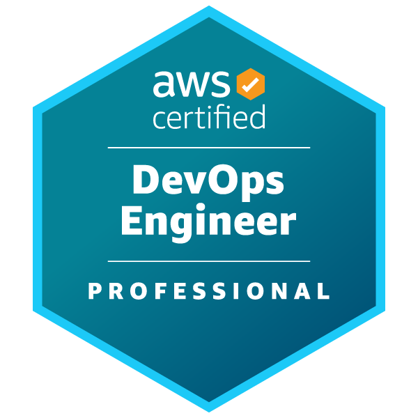
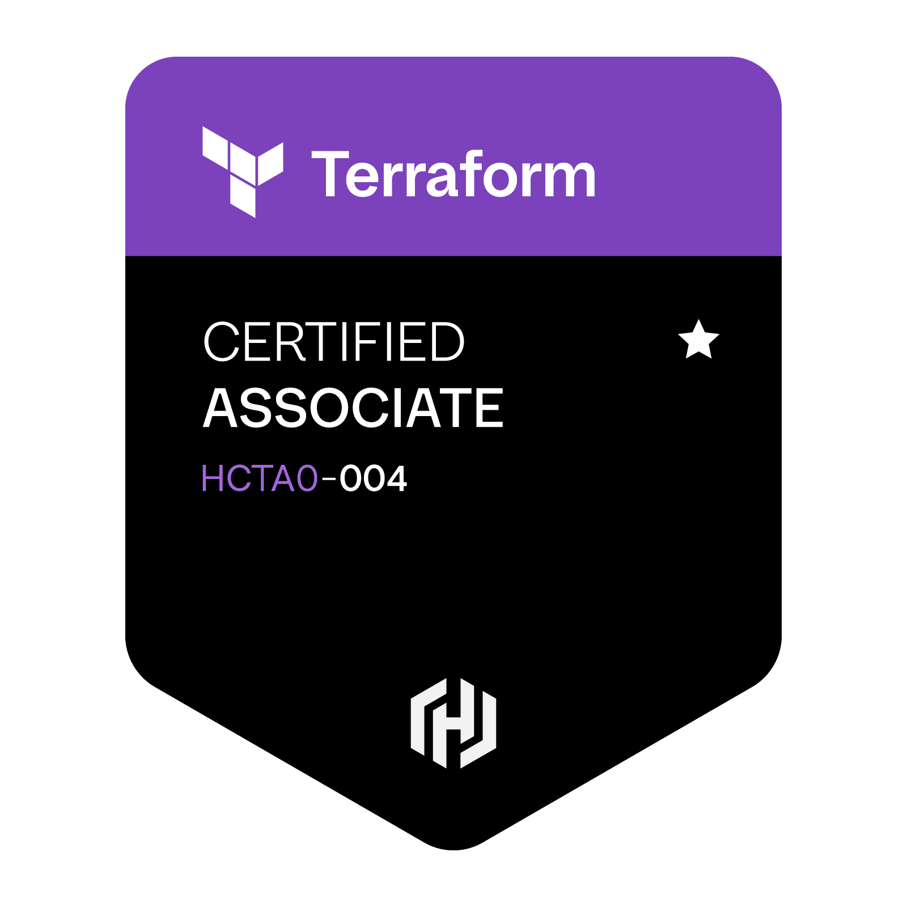

### 🏅 [AWS & Infrastructure Certifications](https://www.credly.com/users/genaro-minetto/badges#credly)

<table>
  <!-- Professional -->
  <tr>
    <td colspan="2" style="border-top: 3px solid #000;"></td>
  </tr>

  <tr>
    <td width="140" align="center">
      
    </td>
    <td>
      <a href="https://www.credly.com/badges/0841c738-197a-402e-81b0-75fb57c12d63">
        <strong>Solutions Architect</strong>
      </a>
       
      <strong>Professional</strong>
    </td>
  </tr>

  <tr>
    <td width="140" align="center">
      
    </td>
    <td>
      <a href="https://cp.certmetrics.com/amazon/en/public/verify/credential/0660d1a75024476f85f524907cd24f9d">
        <strong>DevOps Engineer</strong>
      </a>
       
      <strong>Professional</strong>
    </td>
  </tr>

  <!-- Associate -->
  <tr>
    <td colspan="2" style="border-top: 3px solid #000;"></td>
  </tr>

  <tr>
    <td width="140" align="center">
      
    </td>
    <td>
      <a href="https://cp.certmetrics.com/amazon/en/public/verify/credential/b673f99234fe4b56b60bfb2d2552e8db">
        <strong>Solutions Architect</strong>
      </a>
       
      <strong>Associate</strong>
    </td>
  </tr>

  <tr>
    <td width="140" align="center">
      
    </td>
    <td>
      <a href="https://cp.certmetrics.com/amazon/en/public/verify/credential/3b755a6576cc4e99ad9a850eba6062de">
        <strong>SysOps Administrator</strong>
      </a>
       
      <strong>Associate</strong>
    </td>
  </tr>

  <tr>
    <td width="140" align="center">
      
    </td>
    <td>
      <a href="https://www.credly.com/badges/2035803b-7bfc-4d09-bf43-a3e17ee7bce8">
        <strong>Developer</strong>
      </a>
       
      <strong>Associate</strong>
    </td>
  </tr>

  <!-- Infrastructure -->
  <tr>
    <td colspan="2" style="border-top: 3px solid #000;"></td>
  </tr>

  <tr>
    <td width="140" align="center">
      
    </td>
    <td>
      <a href="https://www.credly.com/badges/6d583412-56df-433a-a88b-c1631ac05aef/public_url">
        <strong>Terraform</strong>
      </a>
       
      <strong>Associate</strong>
    </td>
  </tr>

  <tr>
    <td colspan="2" style="border-top: 3px solid #000;"></td>
  </tr>
</table>
